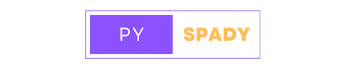

<div align="center">
  
</div>

# PySpady: A Python sparse multi-dictionary coding library
[](https://www.python.org/)
[](https://numpy.org/)
[](https://scipy.org/)
[](https://tensorly.org/stable/index.html)
[](https://pandas.pydata.org/)
[](https://scikit-learn.org/)
[](https://matplotlib.org/)
## Authors
- [Michael J. Paglia](https://github.com/michaelpaglia)
- [Proshanto Dabnath](https://github.com/proshantod)
- [Michael A. Smith](https://github.com/Homercat1234)
- [Joseph Regan](https://github.com/reganjoseph)
## Sponsors
- [Dr. Petko Bogdanov](https://github.com/petkobogdanov/)
- [Maxwell McNeil](https://github.com/maxwell13)
- [Boya Ma]()

## Introduction

PySpady enables users from all disciplines to leverage state-of-the-art and classical sparse encoding algorithms and methodologies to jointly model **spatial-temporal data** by graph and temporal dictionaries. The current implementation efficiently exploits both structural graph regularities and temporal patterns encoded within [**2D temporal graph signals**](https://www.cs.albany.edu/~petko/lab/papers/mzb2021kdd.pdf) and more generally any [**multi-way tensors**](https://arxiv.org/abs/2309.09717) with priors on all or a subset of modes.

## Current features
- [x] Missing value imputation
- [x] Future value prediction
- [x] Automatic hyperparameter optimization
- [x] [TGSD](https://www.cs.albany.edu/~petko/lab/papers/mzb2021kdd.pdf) and [MDTD](https://arxiv.org/abs/2309.09717) optimizers: [Alternating Direction Method of Multipliers](https://stanford.edu/~boyd/admm.html) and [Gradient Descent](https://www.ibm.com/topics/gradient-descent)
- [x] [](https://www.json.org/json-en.html) [](https://pandas.pydata.org/) user input configurations
- [x] Dictionary screening
- [x] Outlier detection with visualizations
- [x] Community detection with visualizations
- [x] Command-line interface
- [x] Demonstration datasets

### Supported Dictionaries

| Transform/Basis Function | Description | Example Use Case(s) | Application(s) |
| --- | --- | --- | --- |
| [Graph Fourier Transform (GFT)](https://en.wikipedia.org/wiki/Graph_Fourier_transform) | Generalizes the Fourier Transform to signals defined on graphs or irregular domains. | Data on non-Euclidean domains, e.g., social networks, sensor networks, biological networks. | Signal denoising, clustering, dimensionality reduction.
| [Discrete Fourier Transform (DFT)](https://en.wikipedia.org/wiki/Discrete_Fourier_transform) | Decomposes a discrete-time signal into frequency components. | Digital signal processing, e.g., filtering, compression, and spectral analysis. | Communications, audio/video processing, and scientific computing. |
| [Ramanujan Periodic Transform](https://en.wikipedia.org/wiki/Ramanujan%27s_sum) | Represents periodic signals as a sum of trigonometric functions with specific frequencies. | Signals with periodic behavior as seen in astronomy, biology, and physics. | Signal compression, feature extraction, and pattern recognition in periodic data. |
| [Basis Spline (B-Spline)](https://en.wikipedia.org/wiki/B-spline) | Piecewise polynomial functions used as basis functions for representing and manipulating curves and surfaces. | Local control, maximizing computational efficiency, and smooth interpolation/approximation. | Computer graphics, curve/surface modeling, and data fitting. |

## Installation
[Clone](https://docs.github.com/en/repositories/creating-and-managing-repositories/cloning-a-repository) this repository's main branch and run the following terminal command in the PySpady directory to download the required dependencies:
```
pip3 install .
```
For signal decomposition, input data in the ```config.json``` file. For tensor decomposition, input data in the ```mdtd_config.json``` file. GFT usage requires an adjacency matrix as input in the respective configuration file.

Run the driver.py file to begin.
```
python3 driver.py
```

Please make sure you already have the latest version of [](https://www.python.org/) and [](https://pypi.org/) installed.

### Datasets

There are numerous datasets available for use in the PySpady library. Due to storage limitations, certain datasets cannot be stored on the Git repository and must be downloaded externally.

- [New York City taxi pickup and dropoff data, circa 2017: 2D temporal graph signal](). Matrix reconstruction utilizes a GFT and Ramanujan periodic dictionary.
- [Global airplane traffic, circa : 2D temporal graph signal](). Matrix reconstruction utilizes .
- [New York City taxi pickup and dropoff data, circa 2017: Multi-way tensors](). Mode-3 tensor reconstruction utilizes a GFT and two Ramanujan periodic dictionaries.
- [Multi-way tensors synthetic data](). Mode-3 tensor reconstruction utilizes a GFT, a DFT, and a Ramanujan periodic dictionary.

2D temporal graph signal synthetic data is already available. The matrix reconstruction utilizes a GFT and a DFT.

--------
# pyspady
PySpady - a Python sparse multi dictionary coding library

Done
optimization 
* TGSD
  * vannila
* MDTD
  * vannila 
  

Implementation
* dictionaries
  


Testing

Todo

1. Some dictionaries
   
3. Front end
   1. data formats (mask as well)
    * matrix input
    * row,col, etc. value inputs 
    * enter csv
    * pandas dataframe
   1. make defaul parameters
   2. config parameters 
   3. how to return missing values 
  
4. Auto config 
   1. auto parameter selections 
   2. graph learning
   3. estimate time to complete 
   4. return explanatory figs?
      
5. Different optimizers 
   1. gradient based
   2. OMP for differnt mod
      
6. Other Models  
   1. 2D-OMP
   2. Low Rank Dictionary Selection 
   3. Different regualriers
   4. coloums sparsity
   5. Can we implement non-negataive on  a dictionary times co-efficents?
      
7. Dictionary selection
   1. 1D Screening
   2. Scaling to large graphs
      
8. Prep datasets as use cases 
  
-------------------------------------------------------------------------------------

TODO
* Boya and Max, can you try to design/describe the interfaces for key functions/classes. For example, we will have something for dictionry generation, then we will have diffeernt solvers for TGSD: 2D OMP and L1, tensors, etc
* Different models: low rank: LYWR (as in TGSD)  or via a rank norm LWR with rank-norm(W); versus non-low-rank as in the separable dictionaries paper or 2D-OMP
* Different optimizers (coding): ADMM (as in TGSD), FASTI or gradient based (from the separable dictionary paper), OMP greedy, Kronecker + vetorize for 1D problem.  


Dictionary Generate Methods atoms should correspond to coloumns 

gen_GFT
  Params:
    numpy array: adjacency matrix
    bool: Normalize 
  Returns:
    a graph fourier transform matrix which is normalized if noramlize true

gen_DFT
  Params:
    int: number of timesteps 
  Returns:
    discrete fourier transform matrix 

gen_Rama
  Params:
     int: number of timesteps 
     int: Max period
   Returns:
     Ramanujan periodic dicitonary 


TGSD
  Params: 
    Left dictionary (Psi)
    Bool describe Orthogonality of Psi
    Right dicitonary (Phi)
    Bool describe Orthogonality of Phi
    Data 
    Missing Value Mask 
    Termination condition
      Fit tolerance
      Max iterations 
    Lambda values 
    Rao values
  Returns:
    Y,Z
    W,U
    completed matrix if appopriate 
    

    

    
    
  
